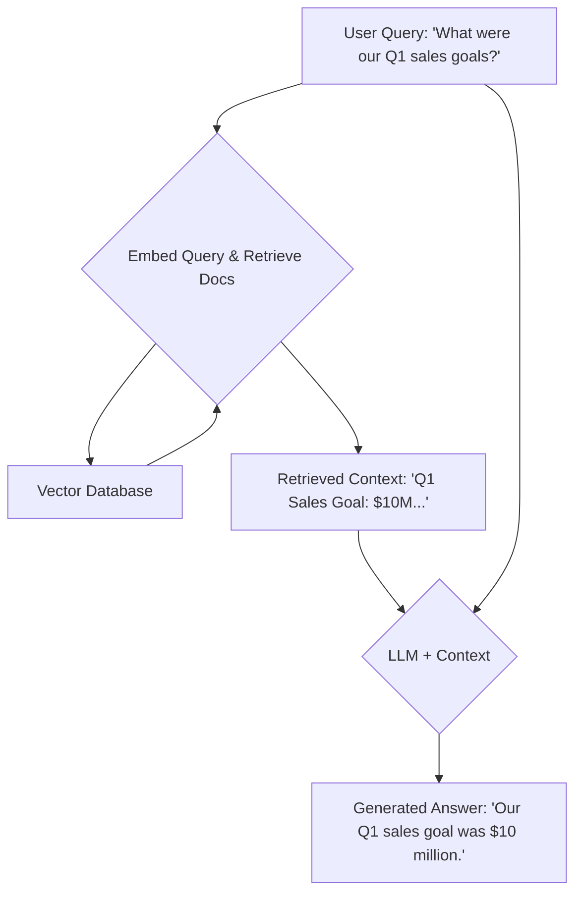

```mermaid
graph TD
    A[User Query: 'What were our Q1 sales goals?'] --> B{Embed Query & Retrieve Docs};
    B --> C[Vector Database];
    C --> B;
    B --> D[Retrieved Context: 'Q1 Sales Goal: $10M...'];
    D --> E{LLM + Context};
    A --> E;
    E --> F[Generated Answer: 'Our Q1 sales goal was $10 million.'];

```